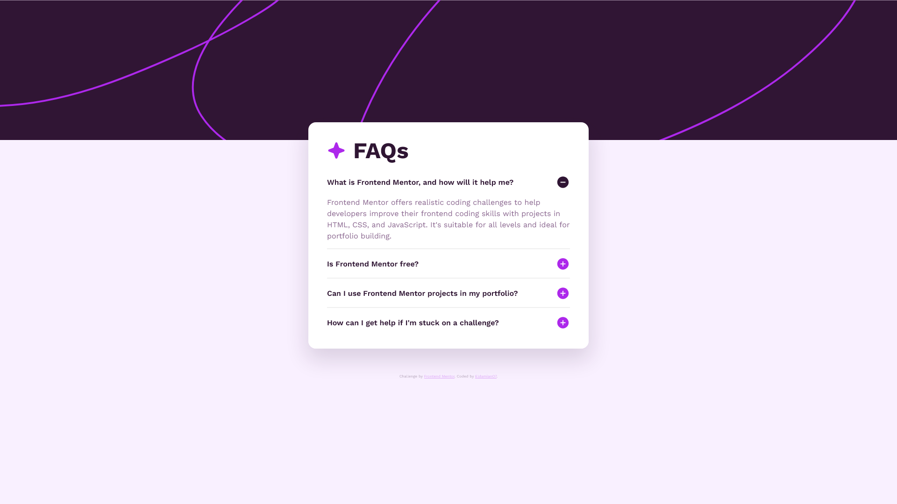

# Frontend Mentor - FAQ accordion solution

This is a solution to the [FAQ accordion challenge on Frontend Mentor](https://www.frontendmentor.io/challenges/faq-accordion-wyfFdeBwBz). Frontend Mentor challenges help you improve your coding skills by building realistic projects.

## Table of contents

- [Overview](#overview)
  - [The challenge](#the-challenge)
  - [Screenshot](#screenshot)
  - [Links](#links)
- [My process](#my-process)
  - [Built with](#built-with)
  - [What I learned](#what-i-learned)
  - [Continued development](#continued-development)
  - [Useful resources](#useful-resources)
- [Author](#author)

## Overview

### The challenge

Users should be able to:

- Hide/Show the answer to a question when the question is clicked
- Navigate the questions and hide/show answers using keyboard navigation alone
- View the optimal layout for the interface depending on their device's screen size
- See hover and focus states for all interactive elements on the page

### Screenshot

### Links

- Solution URL: [Github repo](https://github.com/EldamianO7/faq-accordion/)
- Live Site URL: [Github page](https://eldamiano7.github.io/faq-accordion/)

## My process

### Built with

- Semantic HTML5
- CSS Custom properties
- Flexbox for layout
- CSS transitions
- JavaScript (vanilla) for toggle logic

### What I learned

- I discovered the CSS unit dvh (dynamic viewport height) which is very useful on mobile to avoid weird scrolling when using 100vh (on safari).
- I also practiced creating accessible components with aria-expanded.
- Handling max-height and margin animations at the same time can be tricky, sometimes the animation isn't as smooth as you'd like.
- Learned how to create custom animation curves using `cubic-bezier()` in CSS
- Also practiced using CSS root variables

### Continued development

- I'd like to better handle animations with smoother transitions between height/margin without them desynchronizing.
- I'll keep working on accessibility (keyboard nav, aria-\*, screen reader support).
- I'll also keep working on using semantic HTML, organizing the structure properly, and naming classes clearly, because I think the current markup doesn't meet the standards.

### Useful resources

- [MDN Web Docs](https://developer.mozilla.org/) - This helped me A LOT to understand css properties.
- [Stack Overflow](https://stackoverflow.com/a/39103903/) - This post helped me to fix the collapse animation delay

## Author

- Frontend Mentor – [@EldamianO7](https://www.frontendmentor.io/profile/EldamianO7)
